# Bulk Post Generator

Create hundreds or thousands of WordPress pages, posts or custom post type (CPT) entries from a single CSV file. Built for programmatic SEO: service x location pages, directories, landing pages and any content that follows a repeating pattern.

You can build content **row by row** (one post per CSV row) or with **Cross Combination** (every combination of selected columns), with custom URLs, SEO meta tags, ACF fields and images, all from one screen.

Pure PHP, WordPress APIs, vanilla JS and CSS. No frameworks, no Composer, no external dependencies.

<!-- SCREENSHOT: overview of the plugin, or a GIF of the full flow -->
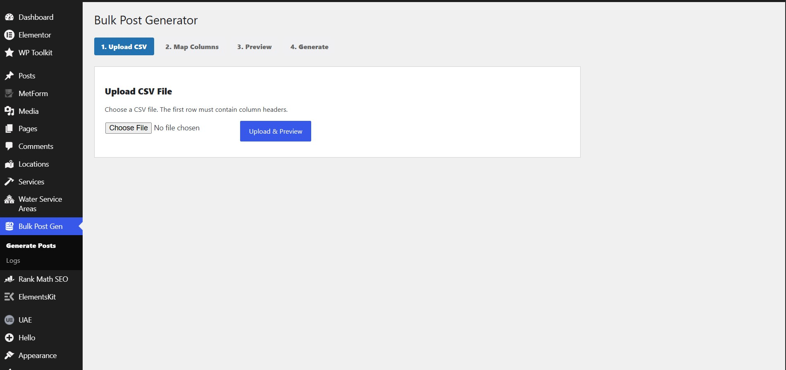

---

## Table of contents

1. [What it can do](#what-it-can-do)
2. [How it works](#how-it-works)
3. [Preparing your CSV](#preparing-your-csv)
4. [Step 1: Upload CSV](#step-1-upload-csv)
5. [Step 2: Map Columns](#step-2-map-columns)
6. [Step 3: Preview](#step-3-preview)
7. [Step 4: Generate](#step-4-generate)
8. [Logs](#logs)
9. [Row by Row vs Cross Combination](#row-by-row-vs-cross-combination)
10. [Placeholders](#placeholders)
11. [Permalink Pattern (URL engine)](#permalink-pattern-url-engine)
12. [Duplicate detection and updating](#duplicate-detection-and-updating)
13. [ACF fields and images](#acf-fields-and-images)
14. [Saved Mappings](#saved-mappings)
15. [Troubleshooting](#troubleshooting)
16. [Known limitations](#known-limitations)

---

## What it can do

| Feature | Details |
|---|---|
| CSV import | Header row required; BOM and Windows line endings handled; preview after upload |
| Any post type | Posts, Pages and custom post types |
| Templates | Title, Permalink Pattern, Meta Title, Meta Description |
| Placeholders | `{column_name}`, case-insensitive, nested placeholders resolved |
| Cross Combination | Multiply 2 or more columns into every combination |
| URL engine | Custom public URLs with nested paths and live validation |
| Duplicate detection | Skip or update posts that already exist |
| Parent / child | Choose a parent page for hierarchical post types |
| ACF support | Fields detected automatically, templates per field, Group fields supported |
| Images | Add images from URLs in the CSV into ACF Image fields |
| Preview | Dry run, nothing is saved |
| Progress and logs | Progress indicator and a log of every row |
| Saved Mappings | Save a full setup and reuse it for other CSV files |

---

## How it works

**1. Upload CSV > 2. Map Columns > 3. Preview > 4. Generate**

Then open **Logs** to check the result.

---

## Preparing your CSV

- The **first row must be column names** (headers)
- Each following row is one entry
- Use clear column names without special characters, for example `service`, `city`, `state`
- For images, add a column with the **full image URL**, for example `image_url`
- Save as CSV (UTF-8)

```csv
service,city,state,description,image_url
Water Damage Repair,Dallas,TX,Fast response for flooded homes.,https://example.com/images/dallas.jpg
Water Damage Repair,Austin,TX,24/7 emergency service.,https://example.com/images/austin.jpg
```

<!-- SCREENSHOT: example CSV in Excel or Google Sheets -->
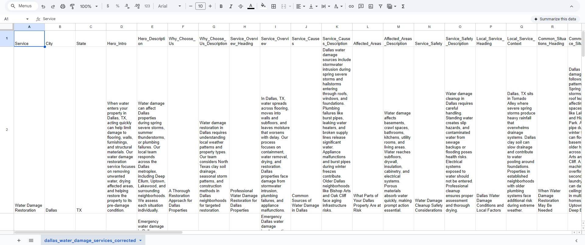

---

## Step 1: Upload CSV

1. Open **Bulk Post Gen > Generate Posts** in the WordPress dashboard
2. Click **Choose File** and select your CSV
3. Click **Upload & Preview**
4. Check the **CSV Preview** table to confirm columns and rows were read correctly

<!-- SCREENSHOT: empty upload screen -->


<!-- SCREENSHOT: CSV preview after upload -->
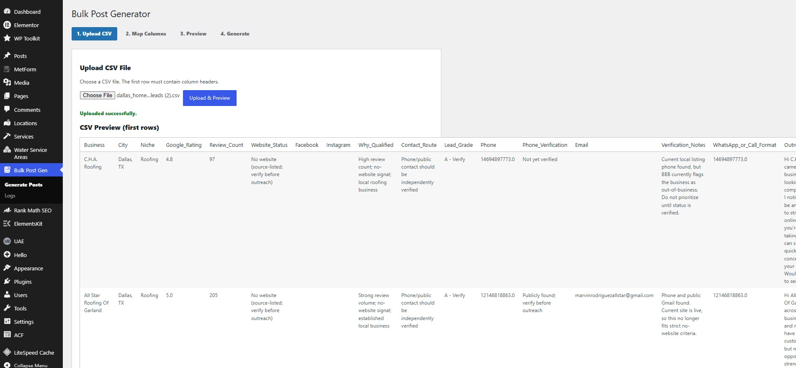

---

## Step 2: Map Columns

This screen controls how every post is built.

> Tip: click a column chip under **Available CSV Columns** to insert it into the field you last clicked. It prevents typing mistakes.

### 2.1 Post Type
Choose where posts will be created: Post, Page or any custom post type.

### 2.2 Parent Page (optional)
For post types that support hierarchy, pick a parent. All generated pages become its children. Choose **No parent (top-level)** if you are unsure. This only affects the page hierarchy in WordPress, not the public URL.

<!-- SCREENSHOT: Post Type and Parent Page dropdown open -->
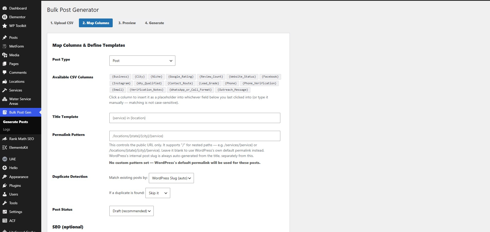

### 2.3 Title Template
Example: `{service} in {city}, {state}`

### 2.4 Permalink Pattern
Controls the public URL. Example: `/locations/{state}/{city}/{service}`. Leave blank for the default WordPress permalink. Details in [Permalink Pattern](#permalink-pattern-url-engine).

### 2.5 Duplicate Detection
- **Match existing posts by:** how the plugin finds an existing post (WordPress slug by default)
- **If a duplicate is found:** **Skip it** or **Update** the existing post

### 2.6 Post Status
**Draft (recommended)** or Publish.

<!-- SCREENSHOT: Available CSV Columns, Title, Permalink, Duplicate Detection, Post Status -->
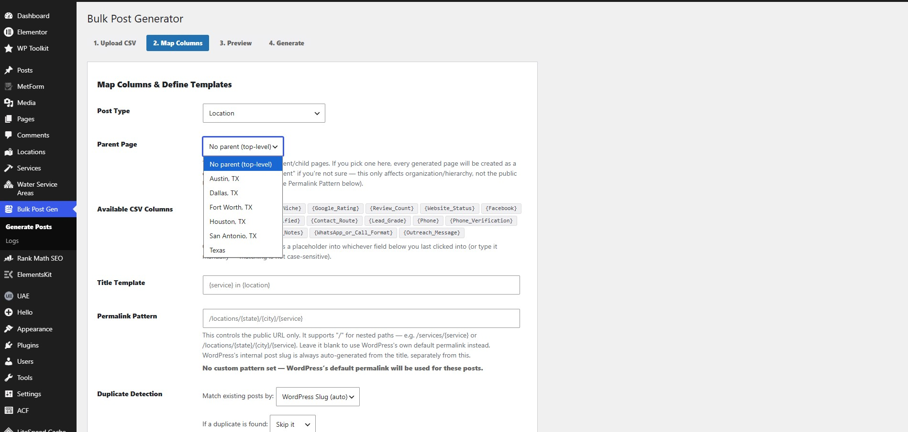

### 2.7 SEO (optional)
- **Meta Title Template**, example: `{service} in {city} | Company Name`
- **Meta Description Template**, example: `Professional {service} in {city}. Contact us today.`

Leave blank to save nothing. Nothing is auto-generated from the title.

<!-- SCREENSHOT: SEO section -->
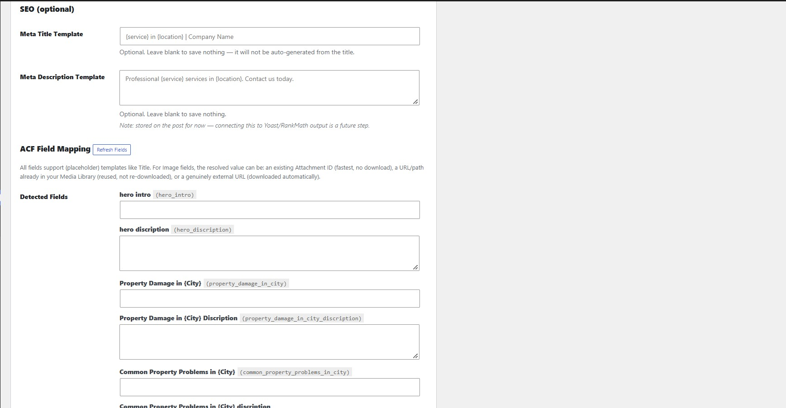

### 2.8 ACF Field Mapping
ACF fields of the selected post type are detected automatically and each one gets its own template box. Click **Refresh Fields** after changing your ACF setup. See [ACF fields and images](#acf-fields-and-images).

<!-- SCREENSHOT: ACF Field Mapping with detected fields -->
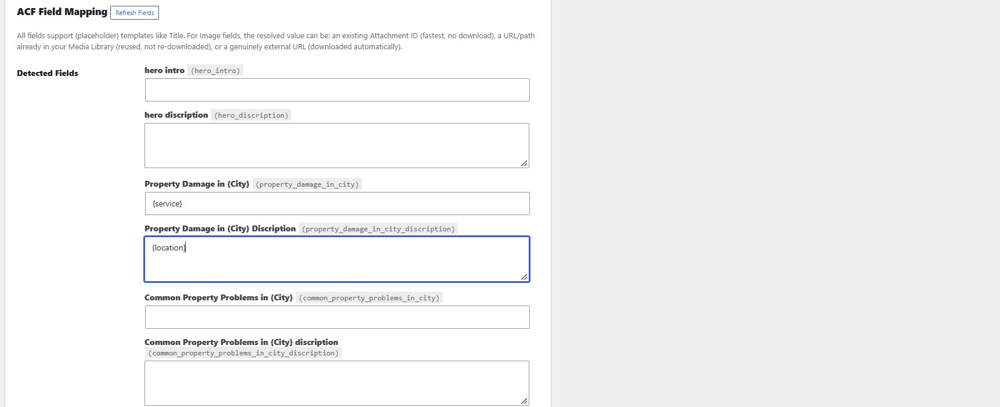

### 2.9 Generation Mode
Choose **Row by Row** or **Cross Combination**. See [Row by Row vs Cross Combination](#row-by-row-vs-cross-combination).

<!-- SCREENSHOT: Generation Mode, Row by Row -->
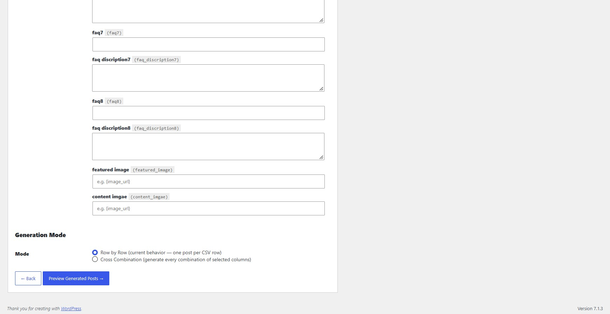

<!-- SCREENSHOT: Generation Mode, Cross Combination with columns checked -->
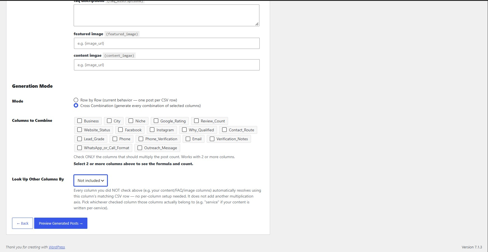

Click **Preview Generated Posts** to continue.

---

## Step 3: Preview

A sample of the posts to be created appears, with title, permalink and meta fields.

**Nothing has been saved yet.** Use **Back to Mapping** to fix anything, or **Looks Good, Start Generation** to continue.

<!-- SCREENSHOT: Preview Generated Posts table -->
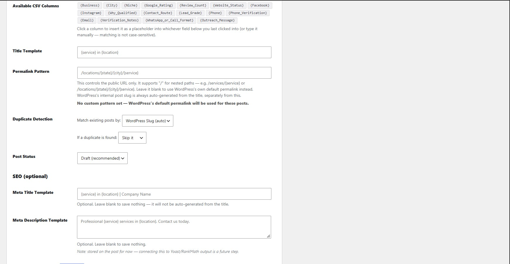

---

## Step 4: Generate

Generation starts and a progress indicator shows how many posts are done. Keep the page open until it finishes.


## Logs

Open **Bulk Post Gen > Logs** after generating. Every row is listed with its result (created, updated, skipped or failed) and the reason for any problem, such as an image that could not be downloaded.

<!-- SCREENSHOT: Logs page -->
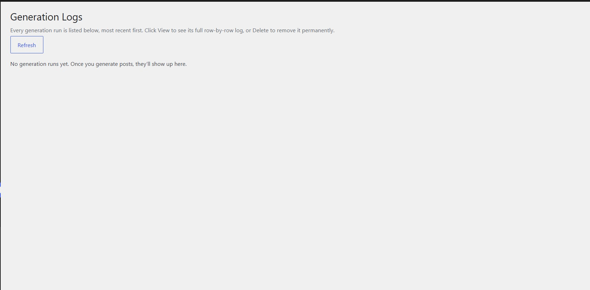

---

## Row by Row vs Cross Combination

You are free to use either mode, depending on how your data is organised.

### Row by Row
One post for every CSV row. Use it when your CSV already lists every page you want.

### Cross Combination
The plugin multiplies the columns you select.

Example: 5 services x 6 cities = **30 pages**, without writing 30 rows.

1. Select **Cross Combination**
2. Under **Columns to Combine**, check only the columns that should multiply the page count (for example `service` and `city`). Select at least 2, there is no upper limit
3. Under **Look Up Other Columns By**, choose the column the remaining columns belong to. All unchecked columns (content, FAQs, images) are then filled in from that column's matching row

**Important:** a column that is not checked and not covered by the lookup has no value, so its placeholder will be empty.

---

## Placeholders

- Syntax: `{column_name}`, using your CSV header
- Not case-sensitive: `{City}` and `{city}` both work
- If a CSV cell itself contains more placeholders (for example `{service} in {city}`), they are resolved too, up to 5 passes
- Use the column chips to avoid mistakes

If a title or URL comes out empty in the preview, the placeholder name does not match a column.

---

## Permalink Pattern (URL engine)

Builds the public URL from your columns.

- Supports nested paths: `/locations/{state}/{city}/{service}`
- Slashes are kept as slashes, never turned into hyphens
- Checked as you type and again on the server: unknown placeholders, empty segments, double slashes, spaces and reserved WordPress paths (such as `wp-admin` or `feed`) are flagged
- Blank pattern means WordPress uses its own default permalink
- WordPress's internal slug is always created from the title, separately from your pattern

Custom URLs need **pretty permalinks** (not "Plain") in WordPress settings.

---

## Duplicate detection and updating

Before creating a post, the plugin checks if one already exists.

- **Skip it:** the existing post is left untouched
- **Update:** the existing post is refreshed with the new data

Use Skip when you only want new pages, Update when you want to refresh old ones.

---

## ACF fields and images

### ACF fields
- Fields for the selected post type are detected automatically, nothing is hardcoded
- Each field has its own template box, so you can mix text and placeholders
- Group fields show their sub-fields
- Click **Refresh Fields** if you changed your ACF setup

### Images
Images work like any other field, they only need a URL.

1. Your CPT has an **ACF Image field** (for example `featured_image`)
2. Your CSV has a column with the full image URL (for example `image_url`)
3. In that image field's box, enter `{image_url}`
4. During generation, the plugin downloads the image into the Media Library and attaches it to the post

The CSV value can be:
- a direct **image URL** (downloaded)
- a **path or URL already in your Media Library** (reused, not downloaded again)
- an **Attachment ID** (used directly)

If an image cannot be resolved, the reason is written to the Logs.

<!-- SCREENSHOT: image fields in ACF mapping with {image_url} filled in -->


---

## Saved Mappings

Save your whole mapping (post type, templates, Cross Combination settings) under a name and load it later for another CSV with the same column names. No need to set up 50 fields again.

<!-- SCREENSHOT: save and load mapping controls -->


---

## Troubleshooting

| Problem | What to check |
|---|---|
| Title or URL is empty in preview | The placeholder name does not match a CSV column. Use the column chips |
| Some placeholders are empty in Cross Combination | The column is not checked and not covered by **Look Up Other Columns By** |
| Custom URL gives a 404 | Make sure pretty permalinks are enabled in Settings |
| Image field stays empty | CSV cell must be a direct image URL, path or Attachment ID. Check the Logs for the exact reason |
| An ACF field is missing | Click **Refresh Fields**, and check that the field belongs to the selected post type |
| Existing posts were not changed | Duplicate Detection is set to **Skip it**. Change it to **Update** |
| Wrong posts created | Use Draft status and Preview every time before generating |

---


## Author

Mr.MorningStar
